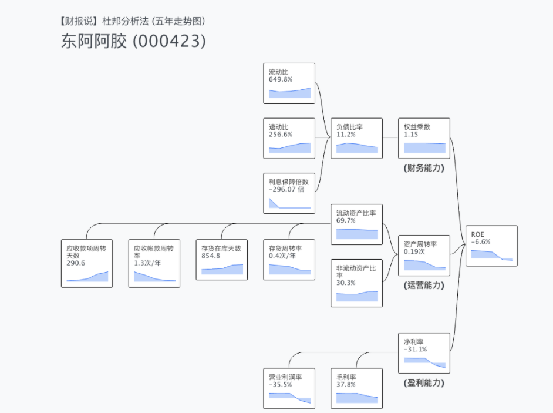

# 最值得关注的指标：ROE

回到前面的话题。到底财报上哪个数字最重要呢？

这个题目，其实在新手界里面有标准的答案。

就是 ROE。

ROE 是巴菲特选股的时候，最重视的指标之一。

巴菲特曾经在1987年的波克夏股东信提到，在他们与财富杂志的研究中，挑选了1000家大公司，只有25间公司过去10年ROE超过20%，且没有一年低于15%。而这25间公司股票中有24间跑赢了市场大盘。

但是如果你是老手的话，一定会嗤之以鼻。认为 ROE 才不是最关键的指标。只看 ROE 会有很多的陷阱与里外，话不是这么说。

实际上，就我自己解析财报的逻辑，我最看重的也不是这个指标。

但 ROE 这个指标，我认为绝对是最值得关注的指标。

围绕著透过这个指标的拆解，几乎透析出 95% 整个公司的经营样貌甚至行业整个的景气变化。

你可能是第一次听到这个说法。

不要紧。下面我就会展示给你看背后的原理。

## ROE 是一间公司的综合实力

ROE 英文全名叫 Return on Equity（股东报酬率）

公式是

> ROE = 淨收益 / 股東權益

白话文就是

> [所有的营收，扣掉成本、营业费用、税之后，最后剩下的纯利润] / [所有股东当初投下去所有的钱]

你可以理解

> 投资 100 万最后入手 XX 万的意思

那这个指标，为什么重要呢？

废话，如果你买了这间公司的股票以后，你就变股东了。

股东报酬率就是你这笔投资的投资报酬率阿。

不看报酬率，你跟人家玩股票玩的上窜下跳到底是在干嘛？

这段名词解释听起来很像废话，但是这却是很多玩股市的人，始终没有理解记进脑子里面去的。

(但是，你会反驳 Amazon 早期也亏的很惨，不赚钱，ROE 超级低甚至是负的。但后来股票也涨成那样，作何解释？别急，这在后面的「青年股、中年股、老年股」的章节，我们会解释到。)

影响 ROE 的因素有很多，所以有人说 ROE 不准。有人说高 ROE 后面是假象。又有人说 ROE 不同行业不能比较，还有人问 有些 ROE 是负的，如何看。

的确，单看 ROE 很难解释出什么东西来。所以，ROE 并不是拿来「单看」的。

## 杜邦分析法

在财报界，我一直觉得有个工具「杜邦分析法」，被远远低估。

这个工具，我称之为「公司X光机」、「照妖镜」。

怎么说呢？我们这里展示两张股票的 X 光图，贵州茅台与东阿阿胶的杜邦分析法：

你注意到差异了吗？

东阿阿胶曾经是中国很有名的优质股票。

这几年股价节节衰退。

现在你知道他出了什么事了吧。

因为 ROE 开始变成负的，股东开始赔钱。

自然股价节节衰退。而引起 ROE 衰退的原因，也非常直观，就是净利率大幅度衰退。

而甚至净利率大幅衰退，是营业利润率大符衰退所造成的。

原本，我们可能要在财务报表上比对数据老半天。

但是，现在用这一套 X 光机手法，并呈现五年变化时，瞬间就一目了然了。

是新手看图，也能知道东阿阿胶的衰退可能原因。

## 解密杜邦分析法的原理

為什麼杜邦分析法可以這麼神奇呢？

這是因為數學公式的轉換。

ROE 原本是　淨利 / 股東權利。

經過數學移項就變成了：

ROE 就變成三組數字乘起來的結果

而照三組數字，其實分別就是財務報表上有意義的數字：

* 淨利率
* 總資產周轉率
* 槓桿倍數

### 淨利率

什麼是淨利率呢？假設你開了一家小吃店。這間小吃店營收是 100 萬，月底結算扣掉成本、食材、店租，並且交稅給政府，最後剩下淨利 10 萬。

那麼淨利率就是 10%。

### 總資產周轉率

而你這個小店的起始資本額是 50。然後一個月做了100萬的營收。

100 / 50 = 2 。總資產周轉率就是 2 。

也就是一個月滾了 2 趟生意一樣。

你可以理解餐廳的翻桌率，就是一天做幾輪生意的意思。

### 槓桿倍數

正常來說

總資產與股東權益是相等的。也就是原先你投資這個小店 50 萬。

而這 50 萬全去買了開麵店的煮麵器具、桌子、椅子，變成了資產。

所以槓桿倍數就是　50/50 = 1。

所以 ROE = 10% * 2 * 1 = 20%

你覺得獲利不錯，想要開分店複製同樣的成績，這時候你不想再投入額外50萬自己開一間了，於是你想要跟銀行借 50 萬。

這時候，資產會變成 2 份。但是股本還是 1 份。接著隨之淨利是 2 份、營收是 2 份。

這叫開 2 倍槓桿。

整個事業體有 2 間公司。ROE = 10% * 2 * 1 = 40%。

所以你開公司原本資本額 50 萬。現在每個月就能賺 20 萬，ROE 達 40%。

有時候公司要快速擴張，會選擇直接向銀行借錢的方式，快速增加獲利。

### ROE 的本質

為什麼 ROE 是最值得注意的公司呢，這是因為既然 ROE 的公式是

>　淨利率 x 總資產周轉能力 x 槓桿倍數

背後的意義就是 ROE 是一間公司

> 獲利能力 x 營運能力 x 銀行關係

的綜合實力展現。

現在讓我們回來看貴州茅台這張圖：

與東阿阿膠的這張圖

是不是感到清晰很多了呢？

### 一般財報書上沒說的事

看完你會覺得很神奇。為什麼一般的財報書上，都沒說這些事呢？

許多的財報書上，教起財報來，都是從

營收 -> 毛利 -> 營業費用 -> 淨利 -> 息稅前利潤

流動資產 -> 固定資產 -> 總資產

一個一個名詞教。學習者不知道這些數字組起來到底有什麼意義，自然就被繞得暈頭轉向。

而一般教科書，就算有提杜邦分析法。不然就是只貼一個樹狀圖：

又或者是只計算解單年數據。

不若用五年數據的顯示版本：

所以閱讀者當然對數據無感。
