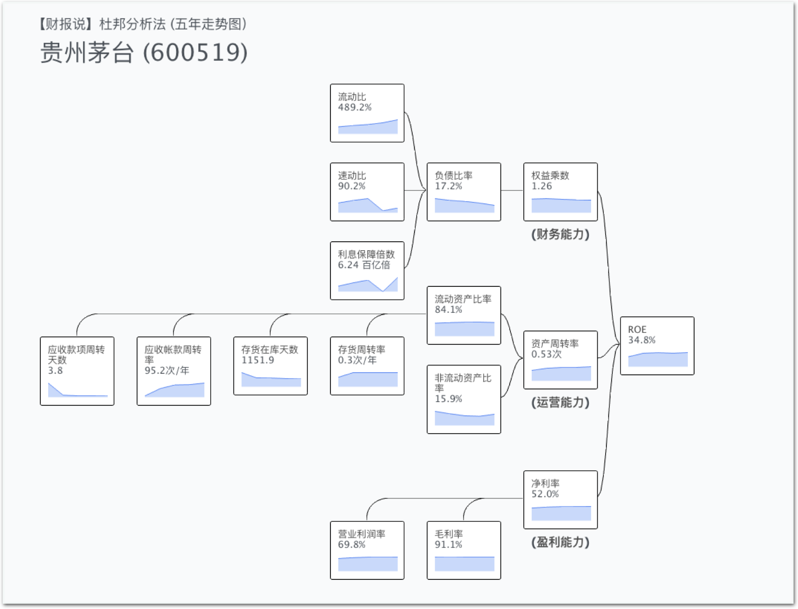
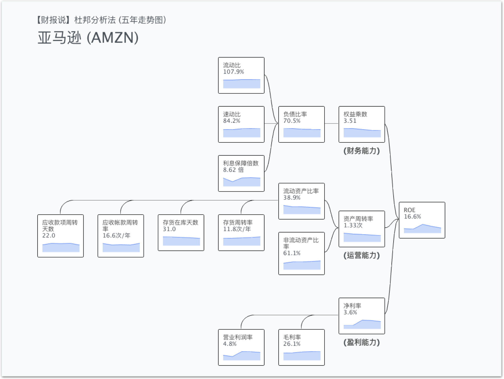
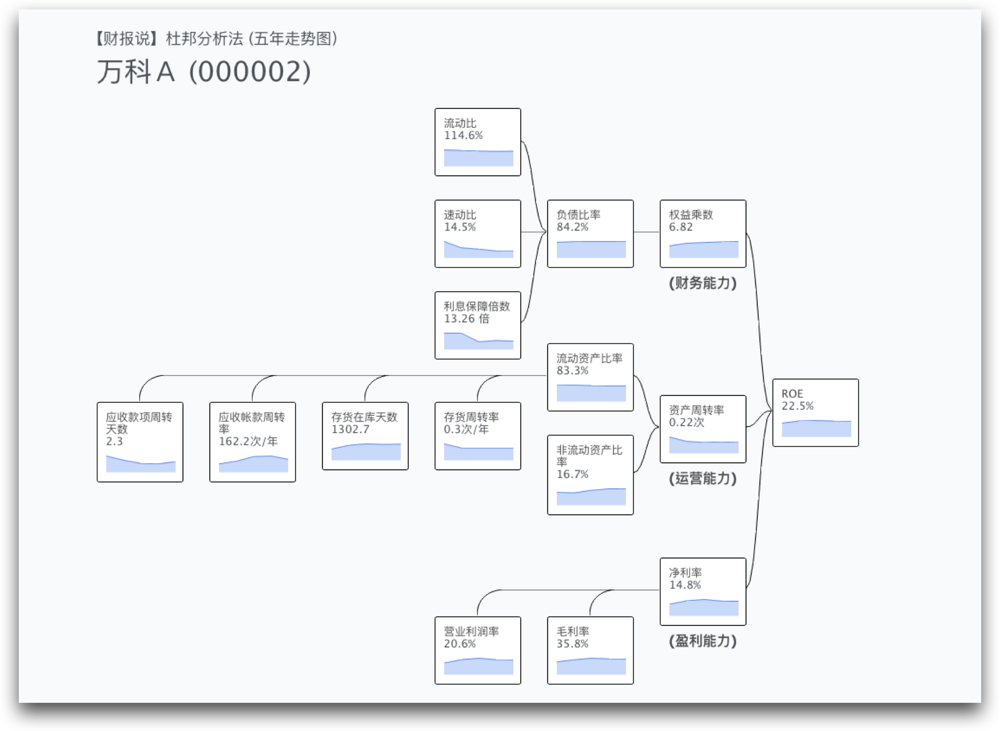
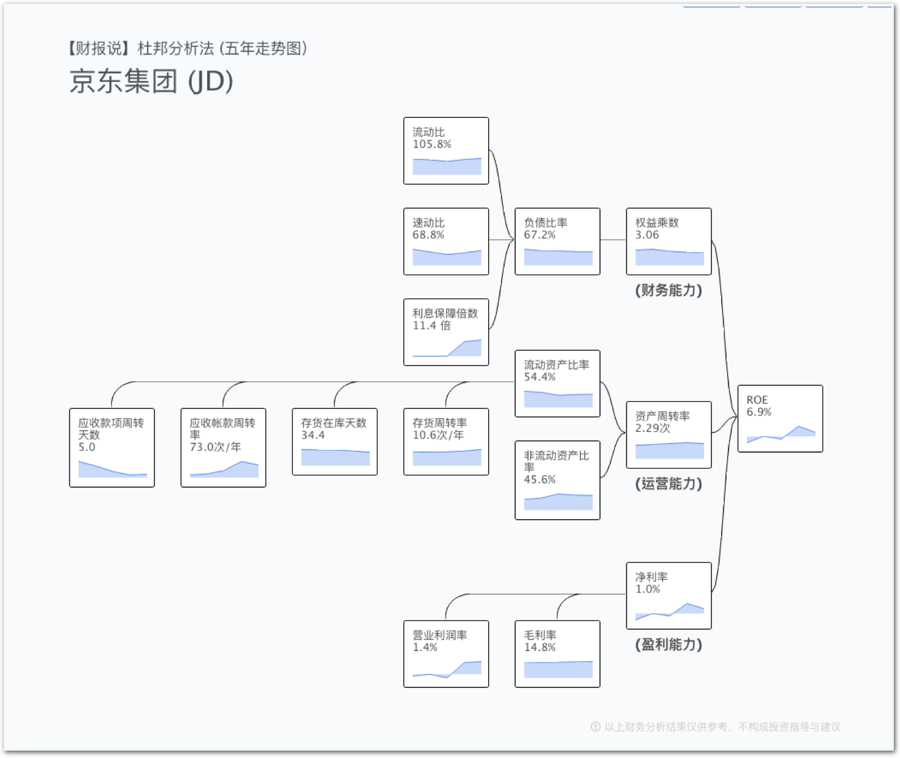
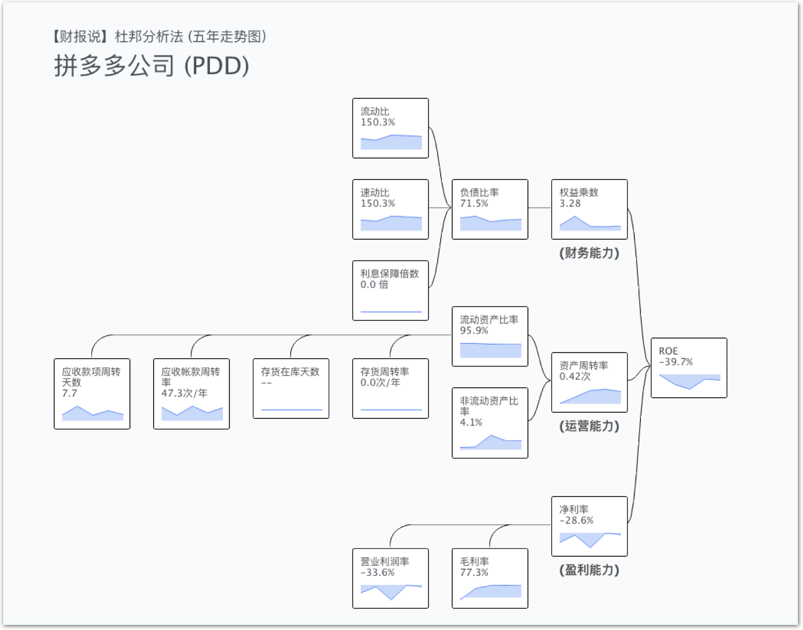
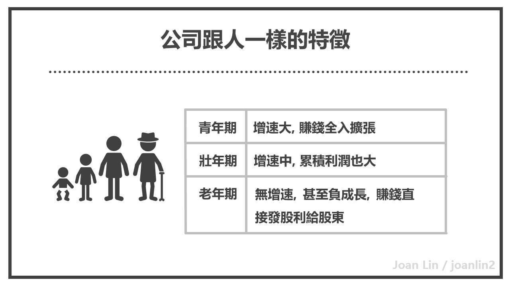

# Ch2 - 如何不張飛打岳飛 談公司間的比較

新手最常犯的錯誤，就是會將不同類型公司，錯誤比較。以為 ROE 比較高的就是好的。

比如說將茅台拿去跟 Amazon  比。

認為茅台 ROE 34.8% 比 Amazon  16.6% 高，就是 茅台比 Amazon  好。

事實上，不同公司不能做這種比較。

如果你要研究財報。通常是要做類似類型的公司的比較，甚至是同行業間的比較。你才能正確判讀數據中的信號。

## 世間公司粗分三大類：利潤型、賣貨型、槓桿型

有了杜邦分析法這個結構模型。我再舉三間公司做為例子，分別是茅台、Amazon 、萬科。

> 茅台高淨利、低周轉

> 亞馬遜低淨利、高周轉

> 萬科低周轉、高槓桿

為什麼有這樣顯著的差異呢？

這是因為每間公司會有自己營業的特性。

* 茅台做的是白酒生意。白酒的原料是水、自然利潤率就高。但是白酒要在倉庫裡面釀很多年才能出貨，所以淨利雖然很高、總資產周轉率卻很低。
* Amazon  做的是批發生意，本質上就是進貨賣貨。所以毛利淨利很低，靠得就是高周轉。COSTCO 也是類似的低淨利高周轉結構。
* 而萬科做的是地產生意。我們往往覺得地產是暴利。但是一般來說，買到一塊地，到真正把樓蓋好售出，要經過很多年的時間，而且因為買地蓋房的成本很高，幾乎都是向建商借錢，所以總資產周轉率通常會很低，而槓桿倍數會非常高。

一般的財務教科書，通常以解說單個比率，再拿不適當的公司比較去當例子，說哪間公司毛利比較高，其實比較好。其實就很有可能變成瞎子摸象，摸到象尾以後覺得象應該長得蛇。

## 鴻海其實是類似 Amazon  的批發商，不是電子製造業

比如說在台灣。很多人就會把台積電與鴻海，放在一起比。

> 台積電：利潤型公司

> 鴻海：周轉型公司

認為鴻海表現比台積電來的差。畢竟台積電的淨利 37.9%，鴻海只有 2% 而已。

台灣的報章普遍也在檢討所謂的電子五哥的「毛三、毛四」。

但事實上，他們根本是不同類型產業阿！

鴻海做的事，本身比較像 Amazon  這種批發商。連財報結構都超像！

鴻海的業務本質是跟上游拿零件，統包組裝成手機出貨給 apple。賺取當中很少的集貨加工成本而已！

而 Amazon 會一直增長的原因，是因為 Amazon  最後的銷貨市場是大眾，而且 Amazon  越賣越多品項。而鴻海主要大客戶是蘋果，所以當蘋果出貨量下降，手機市場飽和，身合組裝場鴻海自然就衰退了。

所以當我們看財報時，拿錯誤的單項數據去研讀是很危險的。必須至少要先粗分這間公司是什麼類型的公司才行！否則就會出現張飛打岳飛亂比較的事件。

依此方法來看，你會發現很多財經報章雜誌，根本就是亂寫一通。看數據編故事！

## 財報只能以同類公司去判讀比較

如果我們真的要進行兩間公司的比較。就必須是兩間同類型的公司去比較。如亞馬遜與京東。

那麼兩間公司比較好呢？

以實際數據來說，應該是 Amazon 比較好。因為亞馬遜的 ROE 是 16.6。京東只有 ROE 6.09%。

但是這裡有個比較貓膩的數據，京東的總資產周轉率 2.29 次高於 Amazon 的 1.33 次。難道是京東營運效率比 Amazon 高嗎？

京東的高資產周轉率的根本原因在於京東的應收款項專轉天數是 5 天。亞馬遜的應收款項周轉天數是 22 天。

難道這代表京東議價能力比較厲害嗎？非也。這是因為兩國國情不同，京東消費者多以微信與銀行卡直接支付（實時收款）。而亞馬遜上的消費者，多以信用卡支付（30日收款）。所以才有這樣的數據差異。

### ROE 是真理吗？

接下来，我们要再来看兩間公司的比較：京東與拼多多。

兩間公司哪間財務狀況比較好？

表面上是京東勝。京東ROE 6.9%，拼多多 ROE -39.7%。

但是電商行業這一行的基本結構是毛利不會很高，而且很怕堆積存貨賣不出去。全靠貨賣得快，賺取利潤。

但如果你看這兩張財報結構圖，就會發現拼多多「沒有存貨」而且毛利超高，高達 77.3%。

拼多多的淨利是都拿去補貼市場擴張了。而拼多多零存貨的本質，是因為拼多多的生意本質是消費者上來湊單，湊滿了廠商才會出貨。消費者經得起等。所以拼多多有接近零存貨的巨大優勢。

互聯網的「燒錢邏輯」是基於網路公司有高毛利，如果可以撐到市場壟斷，就不需要再打廣告，補貼用戶。這樣一來，就會產生巨大的利潤。

這就是拼多多受資本青睞的原因，因為作為電商，毛利竟然可以如此之高，且用另外的財務思路在做電商市場。拼多多現在開始補貼賣高價正品（蘋果電腦、手機等等..），就是這樣的邏輯。

所以，不一定 ROE 是負的。就是不好的公司。

## 公司分三種：青年、中年、老年

不過呢，我認為新手在剛開始選擇投資股票時，還是建議以「正」ROE 的公司為主。

如果我們將不同的上市公司，分為青年、中年、老年的話。

#### 青年公司

青年公司，就像我們年輕人一樣，賺得錢全去買書上課去了。一點餘錢也沒剩下，甚至都還要借貸去進修。這就像拼多多，是增長的公司。終年會不會賺錢不知道。

#### 中年公司

而中年公司，已經成長到一定的經濟實力了。手上有留錢，也會投資自己。就如同亞馬遜一樣。

### 投資選擇

投「青年公司」，雖然增速很大。但中途會不會因為錢借太多花太兇，最後沒能燒成正果，負債累累也說不定。

所以如果你要做長期價值投資，還是選擇「中年公司」比較好。

### 千萬不要相信「存股術」

坊間有一門股票投資技術，叫存股術。這類公司會發比較高的股利，有些菜籃族就會當「比較高的定存」來投。

### 老年公司

這種公司多半屬於「老年公司」。

為什麼這種公司會派發較高額的股利呢？因為這些公司已經過於成熟，「成長」不動了。當利潤投入市場，並不會造成公司再成長的話。這類公司就會選擇「發股利」直接還錢給股東。

這類公司潛藏的陷阱是，因為公司成長不動，甚至規模在衰減，所以公司市值/淨值會下降，股價也會下降。所以你買這類公司的股票，雖然領了紅利，但是股票面額在縮水。
