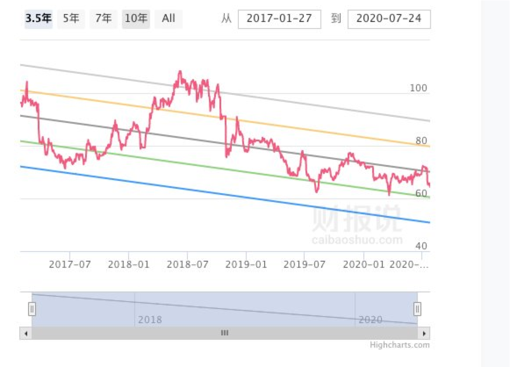
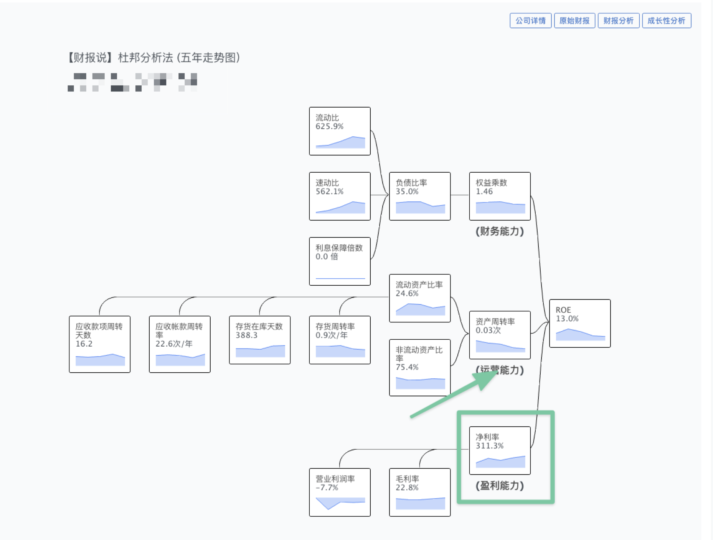
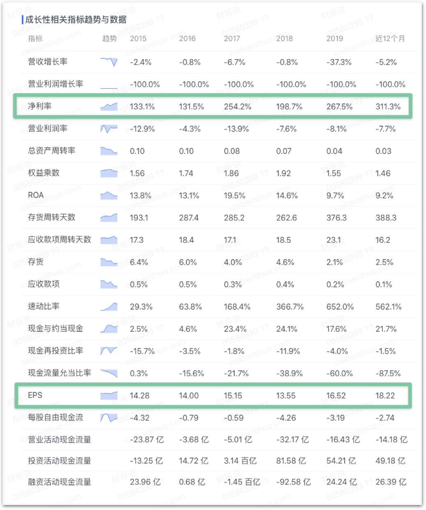
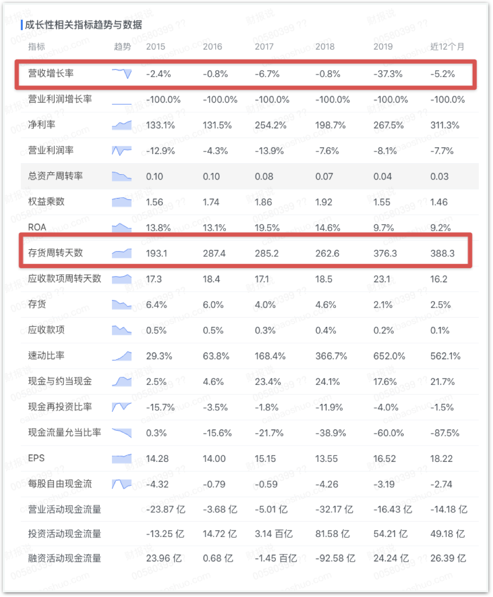

# CH3 - 不可只追捧利潤

## 不可只看淨利率

上一章。我們曾經講過存股術的陷阱。我的姑姑就請我辨別過一支他存股的標的，說這支股票配很高的股息，淨利率也很高。

但為什麼股價節節下跌。

我一打開這間公司的 ROE 還真的是非常高，淨利率高達 311.3%。但是總資產周轉率卻只有 0.03次。

看起來就非常的詭異。

我更仔細打開了詳細數據。才發現這間公司，嚴重美化數據，表面上 ROE 13%，也高配息，EPS 不斷上升。

實則營收下降，貨賣不出去，錢收不回來。

> 淨利率看起來不斷的飆升，EPS也不斷的上漲，似乎一片大好

> 但是實際上，營收增長一動也不動。存貨積壓數量更是膨脹整整一倍。

這就像這間公司一顆包包原先賣 100 顆。原本賣 10000 。

但失去競爭力開始賣不出去，所以把一顆包包賣 20000，賣得更少更慢了。也只能賣 50 顆。

這樣看起來營收不變，淨利率上升。但是存貨放在公司的時間就變長了。

只是勉強營收假象。

### 只看利潤數據、會產生錯覺

當你如果只看財報上的數據， 淨利率 與 EPS 一直在上升時，你會覺得這間公司好有前景。

但是讓你回想一下，如果你是這間公司的員工，貨賣不出去。老闆叫你把貨價格賣兩倍，維持營收。

你會覺得這間公司營運是否已經出問題了？

許多財報書，都是只講單個數據，並沒有回到商業面來模擬解釋。就會中了這種粉飾財務的圈套。

## 不可只看單年 ROE

我們再打開宏達電的財報

你會發現一個詭異的現象。

宏達電在 2018 年的 ROE 突然變正的。這是怎麼回事？

而且明明營業利潤率一直都是負的。怎麼淨利會有一年是正的。

這種兩者邏輯不對稱的事，就要小心。

公司的「利潤」分「營業利潤」與「非營業利潤」。

賣產品、服務的主業收入，叫「營業利潤」。

而另外一種利潤，叫「業外利潤」，指的可能是變賣土地、事業的錢。

這種就是單次的收益。（畢竟祖產只能賣一次）

如果你去翻当年新闻也会发现，这次的收益，是当年宏达电出售事业给 Google 所赚进来的钱。是一次性的。

